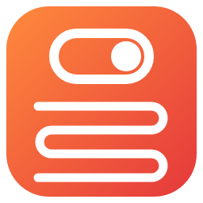

# Tuya/AVATTO Matter Thermostat Relay



Home Assistant custom integration that shows **whether a Tuya-based Matter thermostat is actually heating** – i.e. the state of its relay.

The Home Assistant Matter integration only exposes the standard Thermostat cluster. Many Tuya-based Matter thermostats keep the relay state in a **Tuya manufacturer cluster** (`0x125DFC41`), which Home Assistant ignores. This integration picks that value up and adds a binary sensor **"Heating"** to the existing Matter device.

- **Instant, no polling:** the thermostat reports the relay through the regular Matter subscription; this integration listens to the Matter Server WebSocket (`start_listening`).
- **Automatic:** every supported thermostat gets its sensor, including thermostats commissioned later.
- **Attached to the existing device:** no extra devices, the sensor appears next to the climate entity.

## Supported devices

| Device | Matter vendor / product ID | Status |
|---|---|---|
| WT410 Matter (sold as **micuda** / **AVATTO** WT410, Matter vendor **MIUC**) | 5461 / 2416 | ✅ tested |

Other Tuya-based Matter thermostats may use the same attribute. Only devices listed in `SUPPORTED_DEVICES` (`const.py`) are handled, because other Tuya devices may use attribute 1 of that cluster for something else. Have a different model? See [Adding a device](#adding-a-device).

> **Who is who?** micuda and AVATTO are retail brands. Over Matter the device identifies as MIUC. Under the hood it runs on Tuya's platform (Wi-Fi module and firmware), hence the Tuya manufacturer cluster (`0x125D` is Tuya's vendor prefix).

## Requirements

- Home Assistant **2026.3** or newer
- Matter integration with the Matter Server app (tested with the matter.js based Matter Server)
- The thermostat commissioned into Home Assistant via Matter

## Installation

### HACS (custom repository)

1. HACS → ⋮ → **Custom repositories**
2. Repository: `https://github.com/CharlieLuemmel/ha-tuya-matter-thermostat`, type **Integration**
3. Install **Tuya/AVATTO Matter Thermostat Relay**, restart Home Assistant
4. Settings → Devices & services → **Add integration** → *Tuya/AVATTO Matter Thermostat Relay*

### Manual

Copy `custom_components/tuya_matter_thermostat` to `/config/custom_components/`, restart Home Assistant and add the integration as above.

## Configuration

The only setting is the Matter Server WebSocket URL. It defaults to the URL of your Matter integration (usually `ws://localhost:5580/ws`).

## How it works

```
Thermostat ──(Matter subscription)──► Matter Server ──► HA Matter integration (ignores Tuya cluster)
                                            └──────────► this integration ──► binary_sensor.<device>_heating
```

| Attribute | Path | Meaning |
|---|---|---|
| Relay | `1/308149313/1` | `1` = relay on (heating), `0` = off |

308149313 = `0x125DFC41`. Verified by toggling the setpoint and listening for the relay click; reports arrive instantly via the subscription (the device itself switches a few seconds after a setpoint change).

## Adding a device

1. Find vendor and product ID: Matter integration → device → *Download diagnostics*, attributes `0/40/2` (vendor ID) and `0/40/4` (product ID).
2. Check whether attribute `1/308149313/1` exists and changes when the relay clicks.
3. Open an issue or PR with the IDs and model name.

## Notes and limitations

- Unofficial. Relies on the Matter Server WebSocket message format (`start_listening`, `attribute_updated`). If a Matter Server update changes it, the sensors become unavailable.
- Only the relay is exposed. The other attributes in the Tuya cluster are undocumented.
- If you use [Better Thermostat](https://better-thermostat.org/): it controls the device via the setpoint, so "heating, idle" on the device is normal – this sensor shows when the relay actually switches.

## License

MIT
